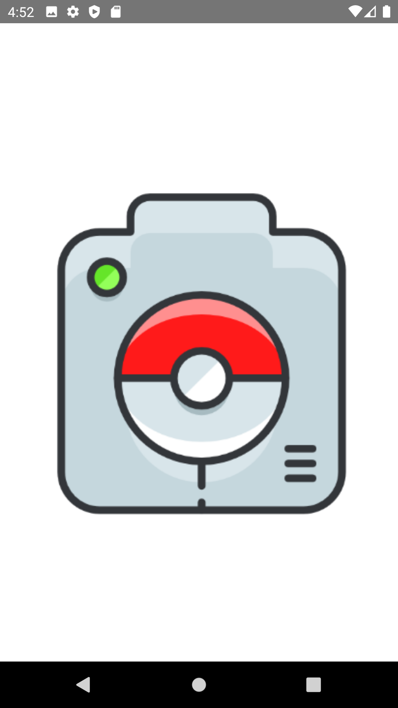

# PRIDE Pokedex

Petit projet de 3A consistant à réaliser une application mobile affichant une base de données (via API) et affichant un certains nombres 
de données, ici nous avons réalisé un Pokedex.

## Les Prérequis

- Installation d'Android Studio
- Connexion Internet pour utilisation de l'API

## Fonctionnalités et Conception

- Appels REST
- Affichage d'une liste avec RecyclerView
- Affichage du détail d'un élément de la liste
- Clean Architecture & MVC
- Stockage en cache de la liste des élément et détails
- SplashScreen au démarrage avec logo Pokedex
- Possibilité de supprimer un élément de la liste en Swipant à droite ou à gauche

## Screens

### Premier Ecran (SplashScreen)

- Affiche un Pokedex

